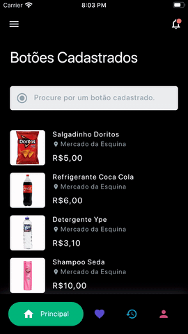
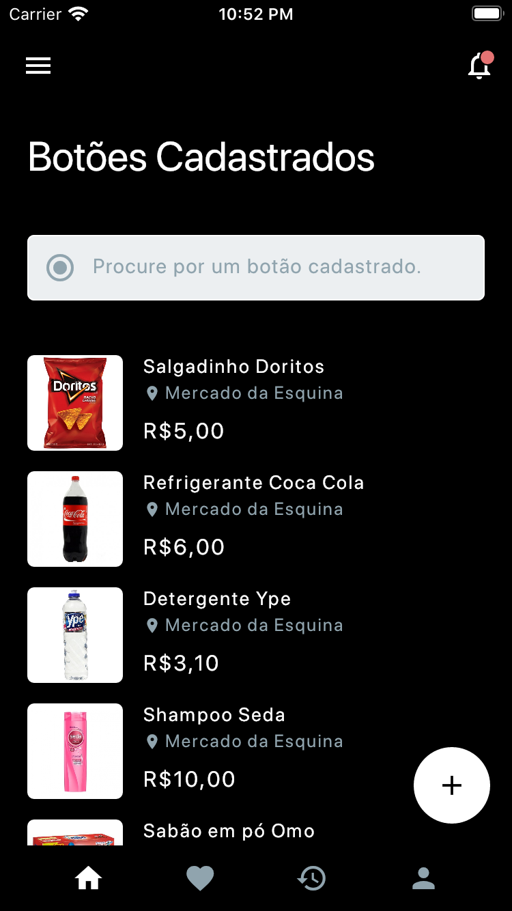
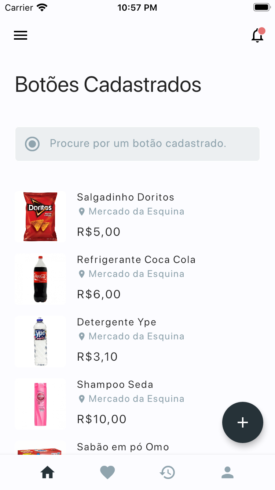
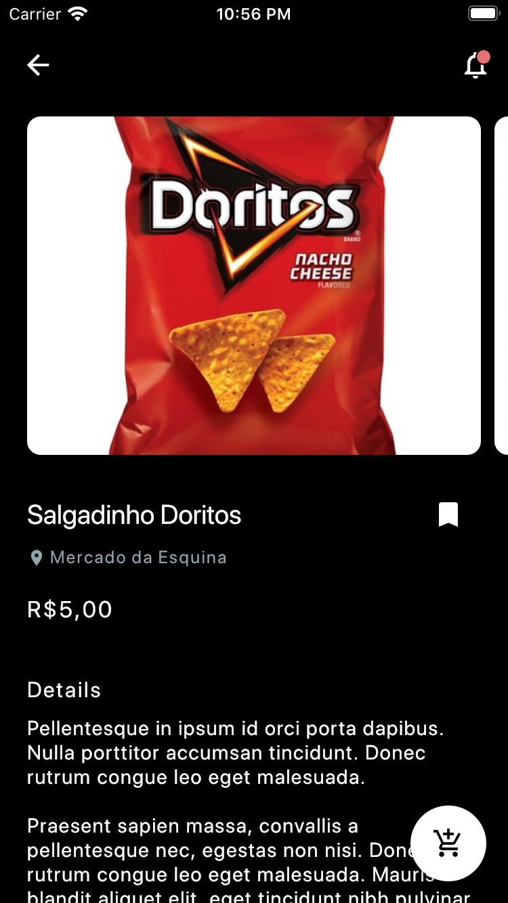
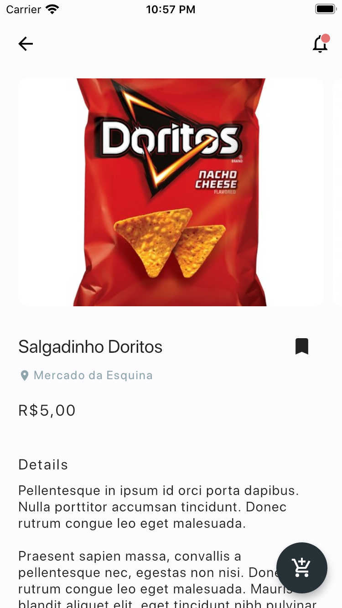

# Aplicação do Dash Button

Aplicação Mobile do trabalho de conclusão de curso de Edimar Calebe Castanho e Gabriel Chaves Borges.

Esta aplicação está em desenvolvimento...

# Screenshots

| Dark Mode | Light Mode |
|:---------:|:----------:|
|  |  |
|  |  |

# Agradecimentos

Esta aplicação é inspirada no conceito de aplicação de viagens do [JideGuru](https://github.com/JideGuru/FlutterTravel).